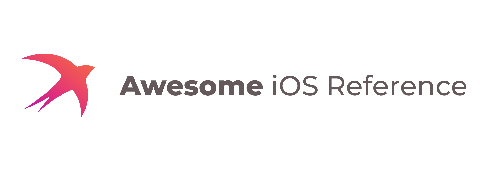

    

---

Reference of the most commonly used resources and frameworks to make iOS development quickier and easier.

 

## Contents

### Documentation
1. **Apple:** [`Archived Documentation`](https://developer.apple.com/library/archive/navigation/), [`Design Guideline`](https://developer.apple.com/design/human-interface-guidelines), [`Documentation`](https://developer.apple.com/documentation), [`Swift Standard Library`](https://developer.apple.com/documentation/swift), [`SwiftUI`](https://developer.apple.com/documentation/swiftui), [`Technotes`](https://developer.apple.com/documentation/technotes), [`WWDC Notes`](https://www.wwdcnotes.com/), [`Xcode-s`](https://xcodereleases.com/)
1. **Swift:** [`Language Guide`](https://docs.swift.org/swift-book/documentation/the-swift-programming-language/thebasics/), [`Language Reference`](https://docs.swift.org/swift-book/documentation/the-swift-programming-language/aboutthelanguagereference/), [`Swift CHANGELOG`](https://github.com/apple/swift/blob/main/CHANGELOG.md), [`Swift Proposals`](https://github.com/apple/swift-evolution/tree/main/proposals)

 

### Packages

1. [**Algorithms and Data Structures**](pages/algorithms_and_data_structures.md): [`General`](pages/algorithms_and_data_structures.md#general) [`Diffing Algorithms`](pages/algorithms_and_data_structures.md#diffing-algorithms)
1. [**Architecture**](pages/architecture.md): [`App Routing`](pages/architecture.md#app-routing) [`Architecute Patterns`](pages/architecture.md#architecute-patterns) [`Dependency Injection`](pages/architecture.md#dependency-injection)
1. [**Compute**](pages/compute.md): [`Math`](pages/compute.md#math) [`ML`](pages/compute.md#ml)
1. [**Concurrency**](pages/concurrency.md): [`EventBus`](pages/concurrency.md#eventbus) [`GCD`](pages/concurrency.md#gcd)
1. [**Date and Time**](pages/date_and_time.md):
1. [**Hardware**](pages/hardware.md): [`Bluetooth`](pages/hardware.md#bluetooth) [`Camera`](pages/hardware.md#camera) [`Device Info`](pages/hardware.md#device-info) [`Haptics`](pages/hardware.md#haptics) [`iBeacon`](pages/hardware.md#ibeacon) [`Location and Motion`](pages/hardware.md#location-and-motion) [`NFC`](pages/hardware.md#nfc) [`Other`](pages/hardware.md#other) [`Wired Connection`](pages/hardware.md#wired-connection)
1. [**Media**](pages/media.md): [`Audio`](pages/media.md#audio) [`GIF`](pages/media.md#gif) [`Image`](pages/media.md#image) [`PDF`](pages/media.md#pdf) [`Processing`](pages/media.md#processing) [`Streaming`](pages/media.md#streaming) [`SVG`](pages/media.md#svg) [`Video`](pages/media.md#video)
1. [**Misc**](pages/misc.md): [`Accesibility`](pages/misc.md#accesibility) [`ARKit`](pages/misc.md#arkit) [`Blockchain`](pages/misc.md#blockchain) [`Debugging`](pages/misc.md#debugging) [`Font`](pages/misc.md#font) [`Functional Programming`](pages/misc.md#functional-programming) [`Games`](pages/misc.md#games) [`Localization`](pages/misc.md#localization) [`Logging`](pages/misc.md#logging) [`Maps`](pages/misc.md#maps) [`Reactive Programming`](pages/misc.md#reactive-programming) [`Reflection`](pages/misc.md#reflection) [`Regex`](pages/misc.md#regex) [`Serverside`](pages/misc.md#serverside) [`Text`](pages/misc.md#text) [`tvOS`](pages/misc.md#tvos) [`User Consent`](pages/misc.md#user-consent) [`Utility`](pages/misc.md#utility) [`VR`](pages/misc.md#vr)
1. [**Networking**](pages/networking.md): [`Bonjour`](pages/networking.md#bonjour) [`Email`](pages/networking.md#email) [`Misc`](pages/networking.md#misc) [`Web Client`](pages/networking.md#web-client) [`Websockets`](pages/networking.md#websockets)
1. [**Parsers**](pages/parsers.md): [`CSV`](pages/parsers.md#csv) [`JSON`](pages/parsers.md#json) [`Other`](pages/parsers.md#other) [`XML HTML`](pages/parsers.md#xml-html)
1. [**Persistence**](pages/persistence.md): [`Archive`](pages/persistence.md#archive) [`Cache`](pages/persistence.md#cache) [`Core Data`](pages/persistence.md#core-data) [`Database`](pages/persistence.md#database) [`Files`](pages/persistence.md#files) [`Network Storage`](pages/persistence.md#network-storage) [`UserDefaults`](pages/persistence.md#userdefaults)
1. [**Project Setup and Environment**](pages/project_setup_and_environment.md): [`Code Quality Tools`](pages/project_setup_and_environment.md#code-quality-tools) [`Gen Tools`](pages/project_setup_and_environment.md#gen-tools) [`Misc Tools`](pages/project_setup_and_environment.md#misc-tools) [`Package Managers`](pages/project_setup_and_environment.md#package-managers) [`XCode`](pages/project_setup_and_environment.md#xcode)
1. [**Security**](pages/security.md): [`Encryption`](pages/security.md#encryption)
1. [**System Services**](pages/system_services.md): [`APNS`](pages/system_services.md#apns) [`Notifications`](pages/system_services.md#notifications) [`Passbook`](pages/system_services.md#passbook) [`Payments`](pages/system_services.md#payments) [`Permissions`](pages/system_services.md#permissions)
1. [**Tesing**](pages/tesing.md): [`Other Tesing`](pages/tesing.md#other-tesing) [`TDD / BDD`](pages/tesing.md#tdd-/-bdd) [`UI Tesing`](pages/tesing.md#ui-tesing)
1. [**UI Foundation**](pages/ui_foundation.md): [`Animations`](pages/ui_foundation.md#animations) [`Colors`](pages/ui_foundation.md#colors) [`Gestures`](pages/ui_foundation.md#gestures) [`Graphics and Drawing`](pages/ui_foundation.md#graphics-and-drawing) [`Layout`](pages/ui_foundation.md#layout) [`Transitions`](pages/ui_foundation.md#transitions)

 

## Credits

- Inspired by:
  - [awesome-ios-ui](https://github.com/cjwirth/awesome-ios-ui)
  - [awesome-android-ui](https://github.com/wasabeef/awesome-android-ui)
  - [python-cheatsheet](https://github.com/gto76/python-cheatsheet)
  - Kindly ~~stolen~~ **forked** from [awesome-ios](https://github.com/vsouza/awesome-ios)

 

## Contribution
This reference is generated automatically. 

Due to a large amount of resources, contents may not be up to date and/or frequently updated. Contribution is always welcome!

If you're willing to make a suggestion or contribution to this project please check the [Contribution.md](CONTRIBUTION.md) first.